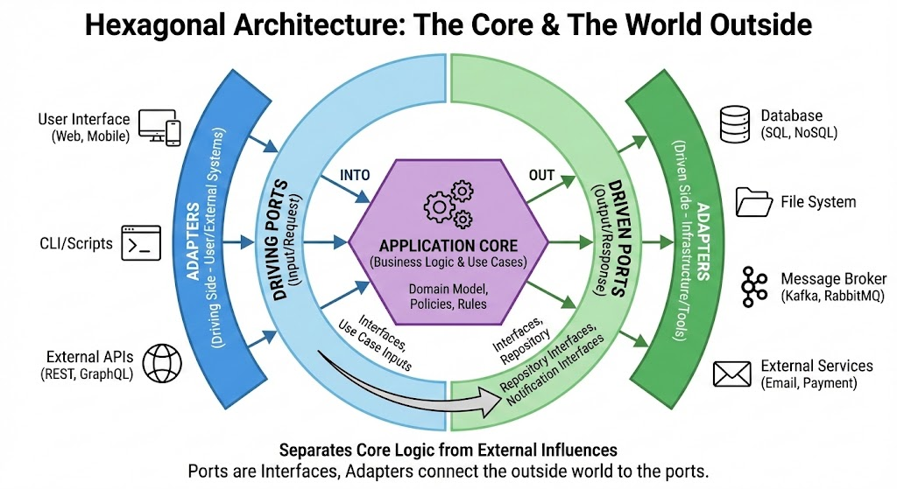

# Ports and Adapters (Hexagonal Architecture)



This project follows the **Ports and Adapters** (also known as **Hexagonal Architecture**) architectural pattern. This approach aims to create loosely coupled application components that can be easily connected to their software environment by means of ports and adapters.

## Core Concepts

### 1. Ports and Adapters

The main idea is that the **Application Core** (Business Logic) should be independent of frameworks, user interfaces, and external systems (like databases or third-party APIs).

- **The Hexagon (Core)**: Contains the Domain Entities and Use Cases. It defines the business rules.
- **Ports**: Interfaces defined by the Core. They serve as entry and exit points.
  - **Driving Ports (Primary)**: Interfaces called by the outside world to trigger logic in the Core (e.g., a Service interface).
  - **Driven Ports (Secondary)**: Interfaces used by the Core to interact with the outside world (e.g., a Repository interface for database access).
- **Adapters**: Implementation details that bridge the gap between the external world and the Ports.
  - **Driving Adapters**: Convert external requests (from a Controller, CLI, or Event) into calls to the Driving Ports.
  - **Driven Adapters**: Implement the Driven Ports to perform actual I/O (e.g., an SQL Repository, an Email Service implementation).

### 2. Inversion of Control (IoC)

**Inversion of Control** is a design principle where the control flow of a program is inverted compared to traditional procedural programming. Instead of the custom code calling a library/framework, the framework calls the custom code.

In the context of this architecture, IoC is crucial for decoupling. The Core defines _what_ it needs (the Port/Interface), but the _implementation_ (the Adapter) is provided from the outside. The Core controls the interface, but the flow of dependency is inverted: the detail depends on the abstraction (Dependency Inversion Principle).

### 3. Dependency Injection (DI)

**Dependency Injection** is a specific pattern used to implement IoC. It involves providing the objects that an object needs (its dependencies) from the outside, rather than having it construct them itself.

In this project, the `UserService` needs to store user data, but it doesn't care _how_ it's stored. It defines a dependency on the `UserRepository` interface.

**Example from the codebase:**

1.  **The Interface (Port)** defined in `src/User/application/UserRepository.ts`:

    ```typescript
    export interface UserRepository {
      saveUser(username: string, password: string): void;
      // ... other methods
    }
    ```

2.  **The Consumer (Service)** defined in `src/User/application/UserService.ts`. Notice how it asks for a `UserRepository` in its constructor:

    ```typescript
    export class UserService {
      private userRepository: UserRepository;

      constructor(injectedUserRepository: UserRepository) {
        this.userRepository = injectedUserRepository;
      }

      signIn(username: string, password: string): void {
        this.userRepository.saveUser(username, password); // Uses the interface
      }
    }
    ```

3.  **The Injection**:
    Instead of `UserService` creating `new UserPostgresSQLRepository()`, we create the repository outside and pass it in:

    ```typescript
    // In the main composition root:
    const myRepository = new UserPostgresSQLRepository(); // The Adapter
    const myService = new UserService(myRepository); // Injection
    ```

**Benefits:**

- **Decoupling**: The `UserService` is not coupled to `UserPostgresSQLRepository`.
- **Testability**: We can easily pass a `UserInMemoryDBRepository` or a mock for testing.
- **Flexibility**: We can switch to `UserMongoRepository` without changing a single line of `UserService`.
